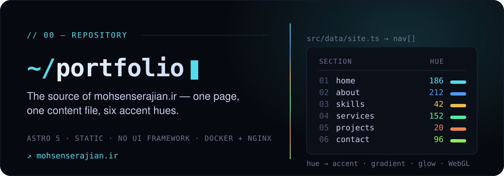
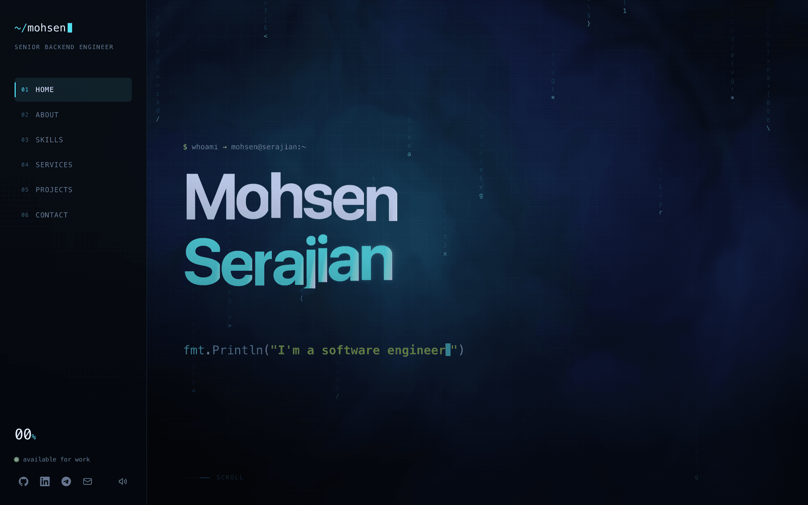
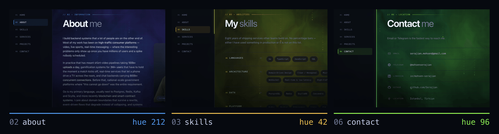

<p align="center">
  
</p>

<p align="center">
  <a href="https://mohsenserajian.ir"><strong>mohsenserajian.ir</strong></a>
  &nbsp;·&nbsp;
  <a href="#run-it">Run it</a>
  &nbsp;·&nbsp;
  <a href="#change-what-it-says">Change what it says</a>
  &nbsp;·&nbsp;
  <a href="#deploy">Deploy</a>
</p>

<p align="center">
  
</p>

## What this is

My personal site — one page, six sections, no CMS and no client-side framework.
Astro renders it to static HTML at build time and a multi-stage Dockerfile hands
the output to nginx. Everything the site *says* lives in a single TypeScript
file, so changing the copy never means opening a component.

## The colour follows you down the page

Every nav entry in `site.ts` carries a `hue` (0–360). That one number drives the
accent, the gradients, the glow **and** the WebGL background. Because `--hue` is
a registered CSS property, the whole theme *animates* between values as a section
scrolls into view instead of snapping to them:

```
home 186 · about 212 · skills 42 · services 152 · projects 20 · contact 96
```

<p align="center">
  
</p>

Neighbours in the scroll order are kept far apart so the shift between sections
reads, and the 250–330 purple/pink arc is avoided deliberately.

## Run it

```bash
pnpm install && pnpm dev
```

| command        | what it does                     |
| -------------- | -------------------------------- |
| `pnpm dev`     | dev server on `localhost:4321`   |
| `pnpm build`   | static output into `dist/`       |
| `pnpm preview` | serve the built output           |
| `pnpm check`   | astro + typescript diagnostics   |

## Change what it says

Everything the site says is in one file:

```
src/data/site.ts
```

Its sections are in the order they appear on the page: `meta`, `nav`, `hero`,
`ticker`, `about`, `skills`, `services`, `projects`, `contact`, `socials`,
`footer`, `boot`. Values still carrying mockup text are marked `TODO`.

Two things are files rather than strings, so updating them is a swap with no
code change:

| what  | path                                | note                                          |
| ----- | ----------------------------------- | --------------------------------------------- |
| CV    | `public/Mohsen-Serajian-Resume.pdf` | keep the filename — it is what visitors save   |
| photo | `src/assets/me.png`                 | must exist or the build fails                 |

The photo goes through Astro's image pipeline, so overwriting it is enough: the
next build re-encodes it to webp at three widths. A cut-out with a transparent
background works best — the frame is landscape and the subject is bottom-aligned
inside it, not cropped.

### The social card

`public/og.png` is what Telegram, LinkedIn and WhatsApp show when the link is
shared. It is generated, not hand-drawn:

```bash
node scripts/make-og.mjs
```

Re-run it after changing the name, role or domain — the strings at the top of
that script are kept in step with `site.ts` by hand, since it runs rarely.
`robots.txt` and `sitemap.xml` are generated at build time from the canonical
domain, so those can never drift out of sync.

## What's inside

```
src/
  data/site.ts        all copy and content
  pages/index.astro   the single page
  layouts/Base.astro  <head>, global css, script entry
  components/         one per section
  styles/global.css   design tokens + every rule
  scripts/            animation modules
    main.ts           entry: wires modules, owns the rAF loop
    background.ts     WebGL shader + glyph rain
    scroll.ts         scrollspy, hue shift, parallax, pinned h-scroll
    cursor.ts         custom cursor, magnetic buttons, card tilt
    curtain.ts        nav click transition
    reveal.ts         scroll reveals, scramble, counters
    hero.ts           name reveal + typewriter
    boot.ts           terminal boot screen
    sound.ts          WebAudio blips
```

Each module exposes an `init` function and, if it animates, an `update` one.
`main.ts` calls those updates from a single `requestAnimationFrame` loop rather
than letting nine modules each start their own.

The page degrades on purpose. Under `prefers-reduced-motion` the loop never
starts and everything renders in a single static pass. If WebGL is unavailable
the body gets `.no-gl` and CSS gradient blobs take over.

## Deploy

The repo ships a multi-stage `Dockerfile` (Node builds → nginx 1.27 serves) plus
an `nginx.conf` with gzip and immutable caching for hashed assets. It exposes
port **80**, carries a health check, and needs no environment variables.

In Dokploy: create an **Application**, point it at this repository, choose
**Dockerfile** as the build type, and expose port **80**.

Before the first deploy, set the real domain in two places:

- `astro.config.mjs` → `site`
- `src/data/site.ts` → `meta.url`

## Why there is no contact form

Static hosting cannot process a POST, and a form that needs a third party to
work is worse than an address that always does. The contact section lists email,
Telegram, LinkedIn and GitHub instead — all of them one tap away.
